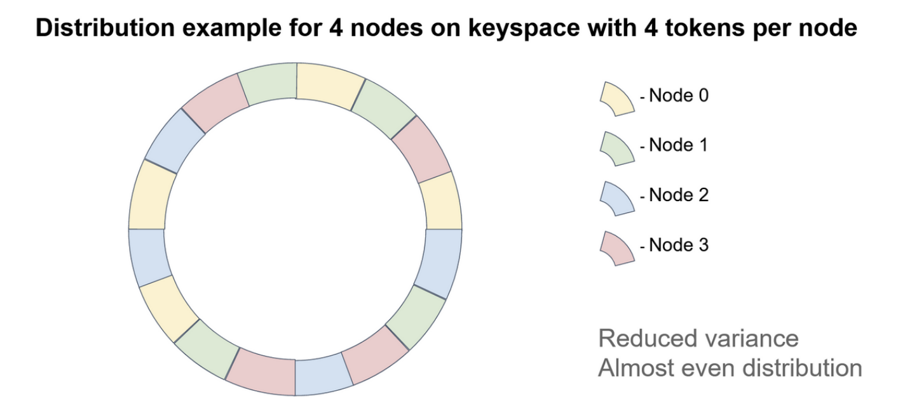
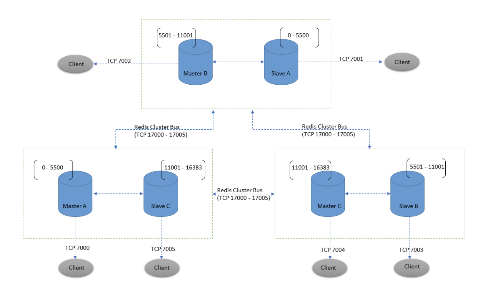
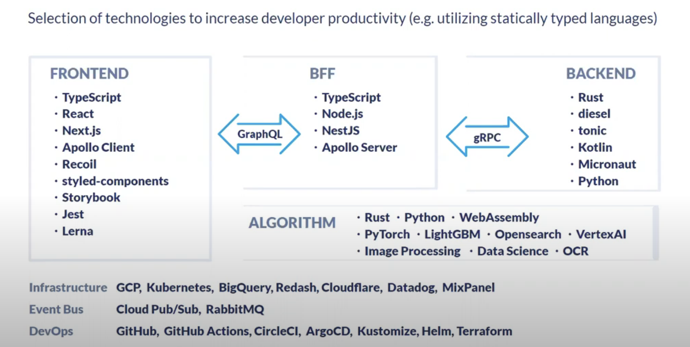

## **INSTACLUSTR**

- Ask about Instaclustr product info (TO TEST THE PROACTIVITIES):
    - Instaclustr provide platform to manage DB and message queue infra on cloud, service support here is:
        - Cassandra, Kafka, ElasticSearch, Spark, ZooKeeper, PostGres

- BE AWARE OF independent working style at Instaclustr.

- Overview about yourself.
    - I am a software engineer that have about more than 3 three years of experience, which one year working in automotive industry and more than 2 year working in finance with in one of biggest commercial bank in Viet Nam. My work mainly work with java and go, when i join ZaloPay, i also been tasked with front end and mobile development with React and React Native.

- Why are you interested in Instaclustr (cloud focus, true AWS)
    - Want to work in cloud technology, currently working as developer perspective. 

- Your ideal job look like:
    - Cutting edge technology.
    - Result oriented.
    - Cloud technology.

- Tech stack wanna learn in ideal jobs:
    - Container technology, distributed system.

- Technical questions: Technical problem issues you solve and what solutions you propose while sharing the context of problems. 

- How about Testing to qualify to code and go work traffic - How much traffic, type of traffic. 
    - Code quality metrics: 
        - Code smell:
            - Bloater 
            - Code duplication
            - Change preventer
        - Test Coverage
        - Vunerability
        - Bug
    
    - Testing:
        - Functional:
            - Unit test
            - Intergration test: using testContainer
            - System test: cucumer
        - Non-functional:
            - Non-function:
            - memory leaks
            - performance
            - toughness
            - load
            - volume
            - scalability
            - usability
            - Security
        - Load Testing: checking system behaviour under load
        - Soak Test: checking system behaviour under load a long time
        - Spike Test: checking system behabiour when spike load

**DATABASE**

- DB to optimize process -> why it works.
    - Query Structure: usually no need because query planner optimize it.
    - DB Structure:
        - Pre-calculating fields 
        - Denormalize data

- Database Optimization:
    - Use EXPLAIN with Your SELECT Queries
    - Add Indexes to Searched Columns
    - Avoid NULL Values by Default: null value can not be utilized with index, and take more space.
    - PROCEDURE ANALYSE() for better columne type.

- Database design:
    - Type of database:
        - Flat file database.
        - Relational database: data in store in table, primary key used for unique identify records, foreign key used for data constraint, index used for faster data retrieval.
            - Pros: good for complex query and data validation
            - Cons: for specific topology such as graph, relational database is not good.
        - Object dababase
        - Network database
- Database optimization tips:
    - Indexing properly
    - Avoid using SELECT *
    - Avoid running query in a loop, using batch insert, update instead
    - Use EXIST instead of count for checking existence
    - Avoid use %%
    - Drop index before bulk insert
    - Use where instead of having

**JAVA**

- What garbage collection is? How use ... when use it?
    - When there is no reference to the object, it will be colleted by garbage colletor to free heap size.
    - Java garbage collection is an automatic process. Unlike C++ when you have to manually release them
- How Java Garbage Collection Works ?
    - Java memory heap generation divide into:
        - Eden: newly created object
        - Survivor: older generation
        - Tenured
    - Garbage colletor assume that object is created and removed pretty fast. It scan the eden space more frequently.
    - Garbage collection in Eden and Survivor are consider Minor Garbage Colletion when it happend in Tenured, it is considered as Major Garbage Collection.
    - Process of garbage collection in java: contain of mark and sweep:
        - Mark: when object is create it marked as 0, when garbage collection checking occur, it transverse the reference of object to checking if there is reference to object, if there is none it still keep as 0.
        - Sweep: During the sweep phase, the garbage collector traverses the heap, reclaiming memory from all items with a mark bit of 0 (false).
        - Compaction
    - What trigger garbage collection:
        - Minor event: when the young generation is full.
        - Major event: when the old generation is full.
    - Ensure object is colleted:
        - Create an object inside a method.
        - Nullify the reference variable.
        - Reassign the reference variable. 
    - Type of garbage collector:
        - Serial collector
        - Parallel collector: have the highest number of object collected, but the lowest throughput, suitable for reporting server.
        - Concurrent mark and sweep: This collector runs concurrently with the application to mark all the live objects. The amount of time that the application has to stop is less so the latency of the application is also less. 
        - G1 is a improvement over the CMS collector is called the G1 collector. It has more footprint and the advantage of this collector is it has the most predictable latency and this is the best feature of this collector. It has specific stop time for garbage collector.
    
- Life cycle and scope in the variable? When variable use?
    - Type of variable in java: local, static, instance (object-specific variables).
    - Static variable: exist entire application.
    - Instance variable: exist until the object is destroyed.
    - Local variable: have block scope, destroy when the block code end.

- Loop example (metric, sql, ...) - output programming

- Heap and stack memory/what sort of programming things to run in the stack, things in the heap? 
    - Heap: for allocate object at runtime
    - Stack: Java Stack stores frames and a new frame is created each time at every invocation of the method. A frame is destroyed when its method invocation completes, java stack contain primitives and reference to object in heap.
    - Class method area: static function, static variable, method code, and the constructor of a Java program.
    - Programming counter
    - Native Method Stack: for code write in other language

- How to array is store in Java:
    - Array is store in Java heap, when array is a array of primitive and then the value is the primitive value, when the array is a array of object, the value is reference to that object.

- Resolve memory leaks in JAVA:
    - Symptoms of memory leaks:
        -  Works fine with small data sets, severe performance issues with large data sets
        - Ever increasing Old-Generation memory usage in your JVM
        - Out-of-Memory Heap errors in your JVM
        - Spontaneous crashes.

- JavaScript and python difference:
    - Similarities: Both are high level scripting language, dynamic typing.
    - Difference:
        - Python:
            - Object based.
            - Use for data anaylysis.
            - Can run anywhere with python interpreter install.
            - Have mutable vs immutable object
        - JS:
            - Prototype based.
            - Use for web development.
            - Run on browser and NodeJS
            - Dont have mutable vs immutable object

- IoC vs DI:
    - The main tasks performed by IoC container are: to instantiate the application class. to configure the object. to assemble the dependencies between the objects. IoC means that objects do not create other objects on which they rely to do their work. Instead, they get the objects that they need from an outside service (for example, xml file or single app service). 2 implementations of IoC, I use, are DI and ServiceLocator.
    - DI is the process of providing the dependencies of an object at run time by using setter injection or constructor injection. DI means the IoC principle of getting dependent object is done without using concrete objects but abstractions (interfaces).
    - Service locator pattern

- Interface in Spring - to achieve interface well.

- How spring work internally:
    - Spring framework is really just a dependency injection container, with a couple of convenience layers (think: database access, proxies, aspect-oriented programming, RPC, a web mvc framework) added on top.
    - You will have to think of the methods inside your ApplicationContext configuration class as factory methods. 
    - Scope of bean:
        - Singleton
        - Session
        - Prototype
    - Spring Aspect-Oriented Programming (AOP):
        - Spring will create a proxy of bean instead of real bean with do-before and do-after hooks.

- Programming paradigm:
    - Imperative
    - Procedural
    - Functional: functions are first class citizen, and it is pure function
    - Declarative
    - OOP

- Java - framework types: 

- How is the best team to work with for you? 
- How did you learn and adopt feedback to improve?
- How to call the solutions in the planning meeting?
- How did you handle the disagreement situation?
- Should add more curious questions to ask interviewers


## **NAVER**

- Singleton best practice:
	- Lazy initialization of Singleton

```java
public class LazyInitializedSingleton {

    private static LazyInitializedSingleton instance;

    private LazyInitializedSingleton(){}

    public static LazyInitializedSingleton getInstance() {
        if (instance == null) {
            instance = new LazyInitializedSingleton();
        }
        return instance;
    }
}
```
	
- In order to execute Singleton thread safe, we use synchronize to block static method in class, only ensure one thread can access code block at the time.

```java
public class ThreadSafeSingleton {

    private static ThreadSafeSingleton instance;

    private ThreadSafeSingleton(){}

    public static synchronized ThreadSafeSingleton getInstance() {
        if (instance == null) {
            instance = new ThreadSafeSingleton();
        }
        return instance;
    }

}
```

- Inconsistency of configuration in class:	- Checking check sum, in kafka message, compare to current check sum, if not match refetch using retry pattern.
	
- Redis Sharding data.
	- Redis Cluster does not use consistent hashing, but a different form of sharding where every key is conceptually part of what we call a hash slot.
	- Every node in a Redis Cluster is responsible for a subset of the hash slots, so, for example, you may have a cluster with 3 nodes, where:
		- Node A contains hash slots from 0 to 5500.
		- Node B contains hash slots from 5501 to 11000.
		- Node C contains hash slots from 11001 to 16383.
	- Master-Replica model:
		- For every master, there is a replica, when master fail, replica will be prompt to master.
		- Redis do not implement string consistency model, but we can write sync with the WAIT command.
		- Under complex situation, lost data always can happend for example: 
		- Take as an example our 6 nodes cluster composed of A, B, C, A1, B1, C1, with 3 masters and 3 replicas. There is also a client, that we will call Z1. After a partition occurs, it is possible that in one side of the partition we have A, C, A1, B1, C1, and in the other side we have B and Z1. 	
		- Z1 is still able to write to B, which will accept its writes. If the partition heals in a very short time, the cluster will continue normally. However, if the partition lasts enough time for B1 to be promoted to master on the majority side of the partition, the writes that Z1 has sent to B in the meantime will be lost.
		- **cluster-node-timeout <milliseconds>**: The maximum amount of time a Redis Cluster node can be unavailable, without it being considered as failing. If a master node is not reachable for more than the specified amount of time, it will be failed over by its replicas. 

	Note that the minimal cluster that works as expected must contain at least three master nodes. For deployment, we strongly recommend a six-node cluster, with three masters and three replicas.


- Consistency hashing:
	- Why the need of virtual node ?
		- If we do not use virtual node, when there is event of partitioning, all the data from one node will move to 1 other node, create a heavy traffic to it. Otherwise if we use virtual node which are randomly distributed across the n physical nodes, when partition happend all other node will be distributed data more evenly.
		- The disadvantage of consistency hashing is range select query.



		 	

- Redis consistency vs hash slot ?
	- Redis use hash slot to assign data, from 0 -> 16383 slot divide evenly into n slot.
	- We can use {} to specify the content which is hash in order to ensure two key will be in the same slot.
	- Redis use CRC-16 hash algorithm as hash function



- Some command use in **redis cluster**:

```sh

SELECT # can not be use in redis cluster, since redis cluster always have index 0

CLUSTER KEYSLOT mykey{node2} # return slot value for key

redis-cli --cluster create 192.168.40.170:6001 
	192.168.40.180:6001 
	192.168.40.190:6001 
	192.168.40.210:6001 
	192.168.40.221:6001 
	192.168.40.222:6001 
	--cluster-replicas 1
```


- ConcurrenHashMap vs SynchronizeHashMap:
	- Collections.synchronizedMap() and ConcurrentHashMap both provide thread-safe operations on collections of data.
	- Sync Map is lock at Object level -> Create overhead for object.
	- ConcurrentHashMap is lock at bucket level. Read can be very fast when write is lock at bucket level.


## **CADDI**
- Key person
	- Yushiro Kato
	- Aki Kobashi 

- Domain: manurfacturing
	- Platform: from requirement analysis and return most suitable supplier.
	- Software: caddi drawer functionality:
		- Drawing analysis: from drawing return dimension and datam
		- Similar drawing search

	- Main system:
		- Cost estimation
		- Data exchange
		- Supply chain manager
		- Drawing management system




## **Li Fung**
- Li & Fung creates customized, end-to-end supply chain and logistics solutions for brands and retailers worldwide.