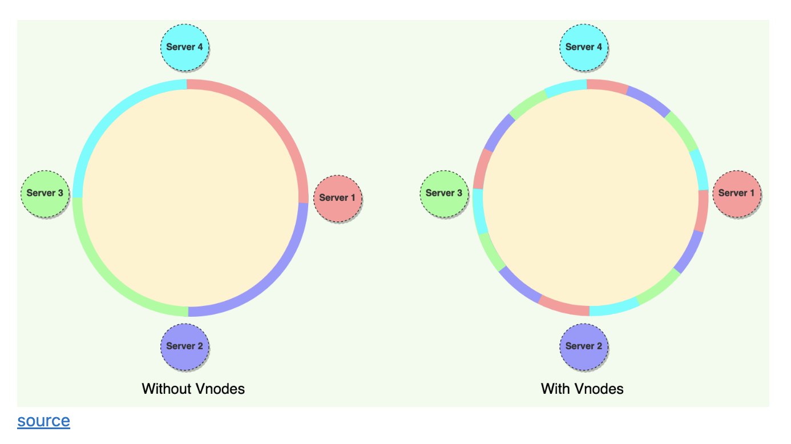

# Redis


## 1. Redis Sharding data

- Redis Sharding data.
	- Redis Cluster does not use consistent hashing, but a different form of sharding where every key is conceptually part of what we call a hash slot.
	- Every node in a Redis Cluster is responsible for a subset of the hash slots, so, for example, you may have a cluster with 3 nodes, where:
		- Node A contains hash slots from 0 to 5500.
		- Node B contains hash slots from 5501 to 11000.
		- Node C contains hash slots from 11001 to 16383.
	- Master-Replica model:
		- For every master, there is a replica, when master fail, replica will be prompt to master.
		- Redis do not implement string consistency model, but we can write sync with the WAIT command.
		- Under complex situation, lost data always can happend for example: 
		- Take as an example our 6 nodes cluster composed of A, B, C, A1, B1, C1, with 3 masters and 3 replicas. There is also a client, that we will call Z1. After a partition occurs, it is possible that in one side of the partition we have A, C, A1, B1, C1, and in the other side we have B and Z1. 	
		- Z1 is still able to write to B, which will accept its writes. If the partition heals in a very short time, the cluster will continue normally. However, if the partition lasts enough time for B1 to be promoted to master on the majority side of the partition, the writes that Z1 has sent to B in the meantime will be lost.
		- **cluster-node-timeout <milliseconds>**: The maximum amount of time a Redis Cluster node can be unavailable, without it being considered as failing. If a master node is not reachable for more than the specified amount of time, it will be failed over by its replicas. 

	Note that the minimal cluster that works as expected must contain at least three master nodes. For deployment, we strongly recommend a six-node cluster, with three masters and three replicas.


- Consistency hashing:
	- Why the need of virtual node ?
		- If we do not use virtual node, when there is event of partitioning, all the data from one node will move to 1 other node, create a heavy traffic to it. Otherwise if we use virtual node which are randomly distributed across the n physical nodes, when partition happend all other node will be distributed data more evenly.
		- The disadvantage of consistency hashing is range select query.




		 	

- Redis consistency vs hash slot ?
	- Redis use hash slot to assign data, from 0 -> 16383 slot divide evenly into n slot.
	- We can use {} to specify the content which is hash in order to ensure two key will be in the same slot.
	- Redis use CRC-16 hash algorithm as hash function


- Some command use in **redis cluster**:

```sh

SELECT # can not be use in redis cluster, since redis cluster always have index 0

CLUSTER KEYSLOT mykey{node2} # return slot value for key

redis-cli --cluster create 192.168.40.170:6001 
	192.168.40.180:6001 
	192.168.40.190:6001 
	192.168.40.210:6001 
	192.168.40.221:6001 
	192.168.40.222:6001 
	--cluster-replicas 1
```

## 2. Redis data type

- Redis data type:
	- SET
	- SORTED SET
	- STRING
	- LIST
	- HASHES
	- STREAMS:  
		- A Redis stream is a data structure that acts like an append-only log. You can use streams to record and simultaneously syndicate events in real time. Examples of Redis stream use cases include:
			- Event sourcing (e.g., tracking user actions, clicks, etc.)
			- Sensor monitoring (e.g., readings from devices in the field)
			- Notifications (e.g., storing a record of each user's notifications in a separate stream)
		- Command: XADD O(1), XRANGE, XREAD, XLEN
		- Stream as listener: XREAD BLOCK 0 STREAMS mystream $
	- REDIS GEOSPATIAL:
		- GEO ADD O(log(N)), by implementation, redis geo use sorted set, where score will be the geohash value of lat and long, when there is need to find cloest position it will use ZRANGE (find by score). 
		- GEO SEARCH O(N + log(M)) where N is total number of coor found and M is total number of coor in all database: GEOSEARCH FROMLONLAT long lat BYRADIUS 1 KM WITHDIST WITHCOORD
	- HYPERLOGLOG: 
		- HyperLogLog is a data structure that estimates the cardinality of a set. As a probabilistic data structure, HyperLogLog trades perfect accuracy for efficient space utilization.
		- The Redis HyperLogLog implementation uses up to 12 KB and provides a standard error of 0.81%. Add and Read is O(1).
		- HyperLogLog solve the problems of **count distinct** value without actually have to store the data.
	- BITMAP
	- BITFIELDS


## 3. Add more shard to redis

- Using command:

```sh
$ redis-cli --cluster add-node 
	192.168.11.134:6379 
	192.168.11.131:6379 # add redis4
	
$ redis-cli --cluster add-node 
	192.168.11.135:6379 
	192.168.11.131:6379 # add redis5
```

- By default only current master will be rebalance, we need it using special flag to force them to rebalance:

```sh

redis-cli --cluster 
	rebalance 192.168.11.135:6379 
	--cluster-use-empty-masters
	
>>> Performing Cluster Check (using node 192.168.11.135:6379)

```

- Remove node from cluster

```sh
redis-cli --cluster reshard 192.168.11.131:6379 
	--cluster-from 6ac62aa8dbb80f982ab1b0fa0623fc54d2bbd77b 
	--cluster-to  9026f2af5a683123abfdd7494da2c73a61803dd3 
	--cluster-slots 3276 
	--cluster-yes
```

## 4. Client Side Caching

	Client 1 -> Server: CLIENT TRACKING ON
	Client 1 -> Server: GET foo
	(The server remembers that Client 1 may have the key "foo" cached)
	(Client 1 may remember the value of "foo" inside its local memory)
	Client 2 -> Server: SET foo SomeOtherValue
	Server -> Client 1: INVALIDATE "foo"

- Redis maintain a global table for cache validation by tracking which data have been called, if this table is exceed limit, all oldest value will be evict, when there is invalidation message, redis check the table and also evict data.

## 5. Pipeline 

	To be explicit, with pipelining the order of operations of our very first example will be the following:
	
	Client: INCR X
	Client: INCR X
	Client: INCR X
	Client: INCR X
	Server: 1
	Server: 2
	Server: 3
	Server: 4

## 6. Pub/sub

## 7. Transaction

- All the commands in a transaction are serialized and executed sequentially. A request sent by another client will never be served in the middle of the execution of a Redis Transaction. This guarantees that the commands are executed as a single isolated operation.

```sh
> MULTI
OK
> INCR foo
QUEUED
> INCR bar
QUEUED
> EXEC
1) (integer) 1
2) (integer) 1

```
- Redis does not support rollbacks of transactions since supporting rollbacks would have a significant impact on the simplicity and performance of Redis.

- Optimistic locking with WATCH

```sh
WATCH mykey
val = GET mykey
val = val + 1
MULTI
SET mykey $val
EXEC
```
- We just have to repeat the operation hoping this time we'll not get a new race. This form of locking is called optimistic locking. In many use cases, multiple clients will be accessing different keys, so collisions are unlikely – usually there's no need to repeat the operation.

- WATCH tell redis that only execute transaction if key under WATCH is non modified.

## 8. Redis pattern

- Distributed locking:
	- Lock property:
		- **Mutual exclusion**: at any given moment, only one client can hold a lock. 
		- **Fault tolerance**: As long as the majority of Redis nodes are up, clients are able to acquire and release locks.
		- **Deadlock free**
	- Distributed locking with redis using SETNX command: **SETNX lock.foo current Unix time + lock timeout + 1**. If SETNX returns 1 the client acquired the lock, setting the lock.foo key to the Unix time at which the lock should no longer be considered valid. The client will later use DEL lock.foo in order to release the lock.
	- If **SETNX** returns 0 the key is already locked by some other client. We can either return to the caller if it's a non blocking lock, or enter a loop retrying to hold the lock until we succeed or some kind of timeout expires.

	- If there is one client fail and did not release the lock, the follwing algorithm will be proposed:
		- C1 send **SETNX** try to acquire the lock, if other client is hold the lock and did not release 0 will return 
		- C1 try **GET** lock to check if the lock is expire, if the lock is not expire than sleep some time and retry. Otherwise use **GETSET** key to get the old timestamp if the it expire than the lock can acquire with **SETNX**, if other client is faster then return data will not expire than we have to try again.


