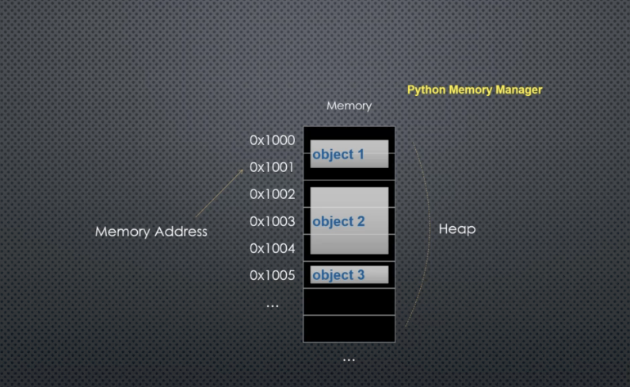
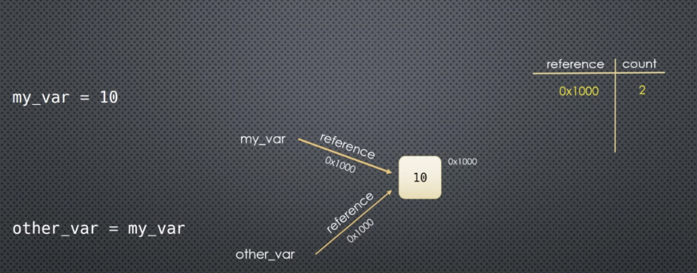
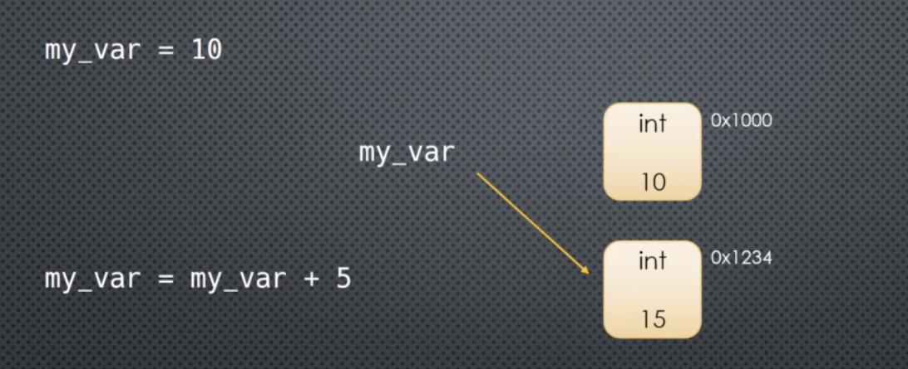
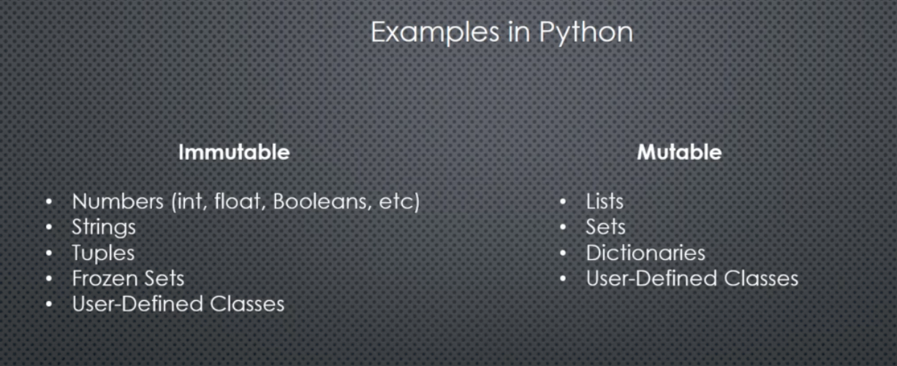
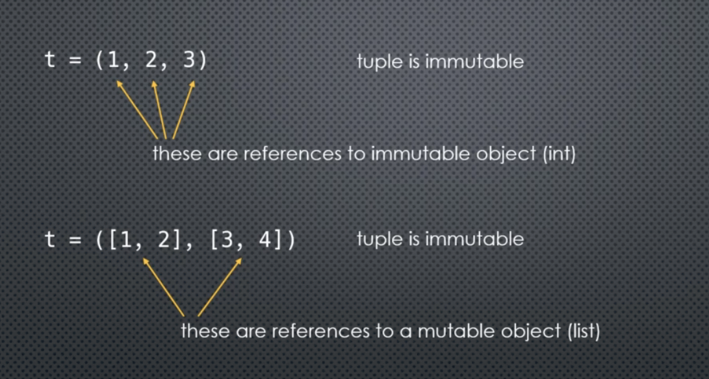
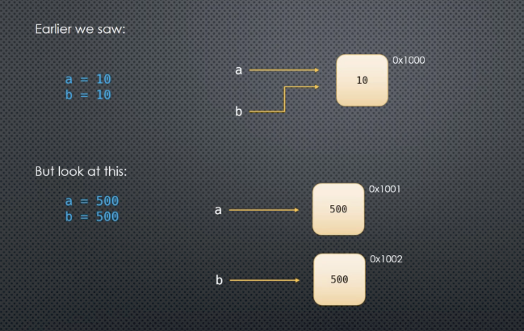

# Python

## 1. Functional & variable.



- In python memory manage by Python memory manager.

```python
a = 100
print(hex(id(a))) # Show memory 0x1014aa6d8
```

- Reference count:




```python
a = [1,2,3]
print(sys.getrefcount(a)) # 2
```

- Garbage collection:
    - Circular reference, GC can detect and reclaim circular reference.
    - For python < 3.4: __del__ can cause order of circular reference important.
    
- Dynamically and statically type:  
  - Dynamically language type is interpret during runtime
  - Statically language type is interpret during compile time

- Re assignment variable: in pythons reassign create new variable and assign variable to it



- Object mutabability:
  - Object can change internal state
  - Reference to object is not changed 





<br/>

- Immutable object are safe from passing through function.

```python

def func(x):
    x = x + "data"
    return x

my_x = "test_"
func(my_x)
my_x # test_ (string is immutable)

```

<br/>

- Share reference:
  - Immuatable object can share referenece

<br/>

- Variable equality:

    ```python
    a = [1,2,3]
    b = [1,2,3]
    print(b is a) # False
    print(b == a) # True

    c = "TEST"
    d = "TEST"

    print(c is d) # True
    print(c == d) # True

    ```


<br/>
<br/>

- Class, type, function in python is objects.
  - They have memory address.
  - Function can be pass to function
  - Function is first class citizen in python

<br/>
<br/>

- Python optimization, interning:
  - Interning meaning reuse object-on demand.
  - At startup, Python (CPython), pre-loads (caches) a global list of integers in the range [-5, 256].



<br/>

- Python optimization, peepphole:
  -  Constant expression: 12 * 60 will be precalculated
  -  Membership test: mutable is replace by immutable counter part, because check membership in **set** is much faster, for example:

```python
if e in [1,2,3]:
    # Will convert to 
if e in (1,2,3):
```


## 2. Numeric data type

- Python type:
  - int
  - float
  - complex