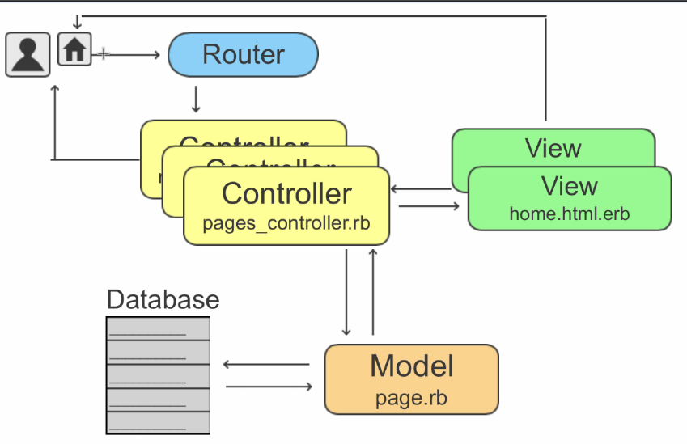

# Ruby

Ruby offers an interesting and powerful compromise, giving you the simplicity of single inheritance and the power of multiple inheritance. A Ruby class can have only one direct parent, and so Ruby is a single-inheritance language. However, Ruby classes can include the functionality of any number of mixins (a mixin is like a partial class definition). This provides a controlled multiple-inheritance-like capability with none of the drawbacks. 

So, is a variable an object?
In Ruby, the answer is ``no.'' A variable is simply a reference to an object. Objects float around in a big pool somewhere (the heap, most of the time) and are pointed to by variables.

## Rails data flow:

- Request make at browser
- Request received at router
- Request send to the right controller
- Controller can:
  - Modified models: models change in db and send back info to controller
- Controller update views

